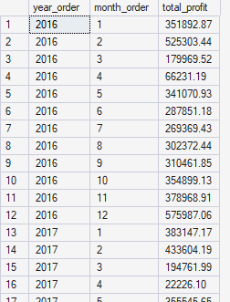
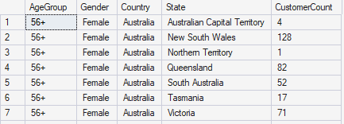
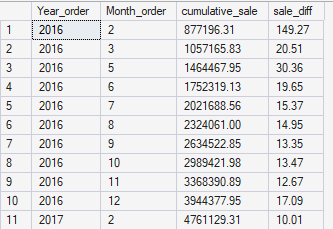
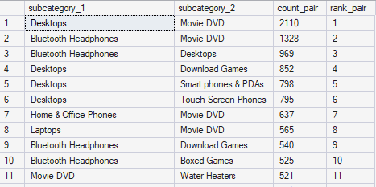
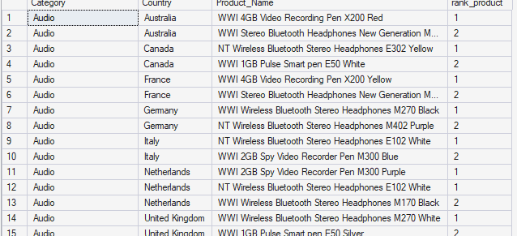
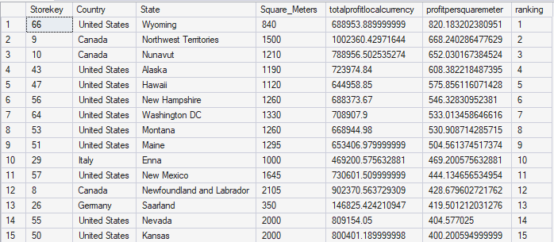
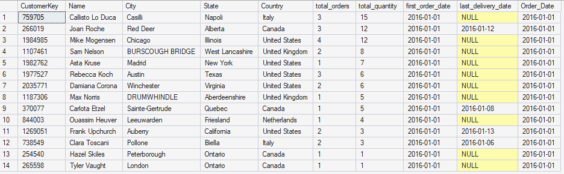
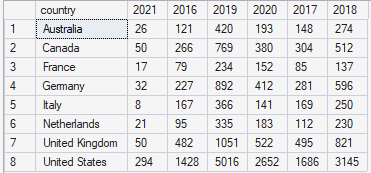

# SQL Advanced Test

This repository contains my SQL solutions for a set of analysis questions using the
Global Electronics Retailer dataset.

## Contents

- `answer.sql`: SQL solutions for the questions (q1, q2, q3, q4, q5, q6, q8, q9).
- `GlobalElectronicsRetailer/`: Source data files (CSV).
- `QUESTION.docx`: Original question prompt.

## Dataset

The dataset is provided as CSV files in `GlobalElectronicsRetailer/`:

- `Customers.csv`
- `Data_Dictionary.csv`
- `Exchange_Rates.csv`
- `Products.csv`
- `Sales.csv`
- `Stores.csv`

## Question and screenshots

### Q1

Monthly profit by year and month.

### Q2

Customer counts by age group, gender, and location.

### Q3

Cumulative profit by month and months with >= 10% growth.

### Q4

Most frequent subcategory pairs in the same order.

### Q5

Top 2 products by quantity per category and country.

### Q6

Store profit per square meter (local currency).

### Q7

Customer order summary for a target order date.

### Q8

Customer order summary for a target order date.

### Q9

Dynamic pivot of total orders by country and year.

## How to use

1. Load the CSVs into your SQL database (the queries use T-SQL syntax).
2. Run the queries in `answer_question _1.sql`.

> Note: The dataset column names in the queries are expected to match the CSV headers.
