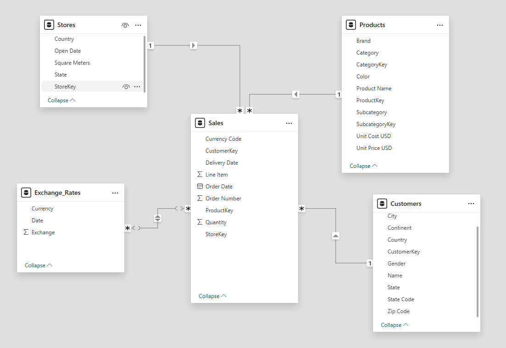

# Global Electronics Retailer – SQL Sales Analysis

This repository contains SQL scripts and sample data used to explore sales and
profit performance for a global electronics retailer and to answer a set of
business‑driven analysis questions.

## Business problem statement

The goal of this project is to help a global electronics retailer understand
**how products, customers, stores, channels, and countries contribute to overall
sales and profitability**. By analyzing historical orders, the business wants to:

- Identify growth opportunities by product category and geography.
- Understand which customer segments and time periods are most valuable.
- Evaluate store performance and efficiency to guide network planning.
- Detect markets, products, or stores that are underperforming or destroying value.

## Business questions

This analysis is designed to answer the following core business questions, each
implemented as a query in `answer.sql` and illustrated in the `assets/` folder.

1. **Monthly profit trend (Q1)**: How does profit evolve by year and month, and
   which periods show strong or weak performance that the business should plan for?
2. **Customer structure (Q2)**: What does the active customer base look like by
   age group, gender, and location, and which segments are most important by size?
3. **Cumulative profit and growth (Q3)**: How does cumulative profit evolve over
   time, and in which months does profit grow by at least 10% compared to the
   previous month (highlighting high‑growth periods)?
4. **Product subcategory affinity (Q4)**: Which product subcategories are most
   frequently purchased together in the same order, and how can this inform
   cross‑sell or bundling strategies?
5. **Top products by country and category (Q5)**: Within each product category
   and country, which products are the top sellers by quantity (top 2), and how
   can that guide assortment and inventory decisions?
6. **Store productivity (Q6)**: For each store, what is the profit per square
   meter in local currency, and which stores are the most and least efficient?
7. **Customer order summary on a target date (Q7)**: For a given order date,
   what are the key details about each customer’s orders (e.g., number of orders,
   total quantity, total amount) to support daily or event‑based analysis?
8. **Dynamic order pivot by country and year (Q8)**: How many orders are placed
   in each country by year, using a dynamic pivot that automatically adapts to
   new years without changing the SQL?

## Contents

- `answer.sql`: SQL queries that answer the analysis questions (Q1–Q8).
- `GlobalElectronicsRetailer/`: Source data files (CSV).
- `QUESTION.docx`: Original question prompt.
- `assets/`: Example result screenshots for each question.

## Dataset description

The dataset is provided as CSV files in `GlobalElectronicsRetailer/`:

- `Customers.csv`: Customer master data (demographics and location).
- `Products.csv`: Product catalog, including categories and subcategories.
- `Stores.csv`: Store information, including location and size (square meters).
- `Sales.csv`: Transaction‑level sales with dates, products, quantities, and revenues.
- `Exchange_Rates.csv`: Currency exchange rates for converting to local or base currency.
- `Data_Dictionary.csv`: Column‑level definitions for all tables.

## Data model

The high‑level data model of the Global Electronics Retailer dataset is shown below:

Refer to `Data_Dictionary.csv` for precise table and column definitions.

## Results

### Question 1 – Monthly profit by year and month

Write an SQL query to calculate **total profit** grouped by **year and month**
and ordered chronologically.

### Question 2 – Customer counts by age group, gender, and location

Write an SQL query to **classify customers into age groups** and then calculate
the **number of customers** by **age group, gender, and location (e.g., country/city)**.

### Question 3 – Cumulative profit and months with ≥ 10% growth

Write an SQL query to compute **cumulative profit by month** and flag those
months where **month‑over‑month profit growth is at least 10%**.

### Question 4 – Most frequent subcategory pairs in the same order

Write an SQL query to identify **pairs of product subcategories** that most
frequently appear **together in the same order**, ordered by frequency.

### Question 5 – Top 2 products by quantity per category and country

Write an SQL query to rank products by **total quantity sold** within each
**product category and country**, and return only the **top 2 products** in each
category–country combination.

### Question 6 – Store profit per square meter (local currency)

Write an SQL query to calculate **profit per square meter** for each store in
its **local currency**, combining profit and store size information.

### Question 7 – Customer order summary for a target order date

Write an SQL query that, for a **given order date**, summarizes **per‑customer**
metrics such as number of orders, total quantity, and total revenue or profit.

### Question 8 – Dynamic pivot of total orders by country and year

Write an SQL query using **dynamic pivot** (or equivalent) to calculate the
**total number of orders** for each **country**, with **years as dynamic
columns**, so that new years are handled without changing the SQL.

## Insights and recommendations

### Key insights (from query results)

- **Profit seasonality (Q1)**  
  Profit shows clear seasonality, with some months and quarters consistently stronger than others (for example, year‑end periods tend to outperform mid‑year periods). This pattern implies the business should align inventory, staffing, and campaigns with peak months and plan targeted actions for structurally weaker periods.

- **Customer structure (Q2)**  
  Customer counts vary meaningfully by age group, gender, and geography (country/state/city). Some customer segments appear concentrated in a few locations while other areas remain relatively small, which is useful for prioritizing targeting, channel mix, and localized assortments.

- **Cumulative sales and growth (Q3)**  
  Cumulative sales increase over time, but month‑over‑month growth rates show signs of slowing rather than accelerating. This pattern suggests the business is still growing but may need targeted initiatives to sustain or lift the growth trajectory.

- **Subcategory affinity (Q4)**  
  Desktops + Movie DVD is the top co‑purchase pair (2,110), followed by Bluetooth Headphones + Movie DVD (1,328) and Bluetooth Headphones + Desktops (969). Movie DVD appears often as a complement to devices; tech and entertainment show strong bundling potential. The Movie DVD + Water Heaters pair is an outlier and may need a data or definition check.

- **Top products by category and country (Q5)**  
  Top products differ by country even within the same category, meaning “best sellers” are not always globally consistent. This supports a localized assortment strategy: prioritize the top‑ranked SKUs per market, while using cross‑market comparisons to identify products that could be scaled to similar countries.

- **Store profit per square meter (Q6)**  
  Wyoming leads (820.18 profit/m²), with Northwest Territories and Nunavut also strong. Nevada and Kansas sit at the bottom (~400–405 profit/m²) despite similar or larger store size. High total profit does not always mean high efficiency (e.g. Northwest Territories has highest total profit but ranks second on profit/m²). Benchmark best performers and investigate underperformers for layout, mix, and costs.

- **Customer order summary by date (Q7)**  
  For the 2016‑01‑01 cohort, total orders range 1–4 and total quantity 1–15; many rows have NULL last_delivery_date. This points to possible pending deliveries, missing delivery data, or different fulfillment types. Improve delivery tracking and use order/quantity patterns for segmenting and follow‑up campaigns.

- **Orders/profit by country and year (Q8)**  
  Across the countries shown, order volume is uneven by market, with a clear peak around 2019 and a notable drop in 2020–2021. Use the dynamic pivot to track recovery by market, compare year‑over‑year changes, and prioritize investment where demand rebounds fastest.

### Recommended actions

- **Seasonality and growth**  
  - Ramp inventory and promotions for December and February; run targeted campaigns in March–April to soften the Q2 dip.  
  - Investigate causes of slowing month‑over‑month growth (Q3) and test initiatives (pricing, promotions, new categories) to re‑accelerate.

- **Bundling and cross‑sell**  
  - Create bundles for Desktops + Movie DVD and Bluetooth Headphones + Movie DVD; feature “Customers also bought” recommendations on device pages.  
  - Keep Movie DVD and Download Games well stocked and visible near Desktops and headphones; review the Movie DVD + Water Heaters pairing for data quality or segment-specific behavior.

- **Assortment and localization**  
  - Use top‑2 products by category and country (Q5) to set core assortments and plan promotions per market.  
  - Replicate successful products (e.g. certain Bluetooth Headphones, Video Recording Pens) in countries where they are not yet in the top two, where relevant.

- **Store network**  
  - Document and share practices from high profit/m² stores (e.g. Wyoming, Northwest Territories).  
  - For low profit/m² stores (e.g. Nevada, Kansas), review layout, product mix, staffing, and local demand; set improvement targets and consider space reduction or format changes if no improvement path.  
  - Use profit per square meter as a core KPI for store and regional evaluation and resource allocation.

- **Customer and operations**  
  - Focus loyalty and retention on the largest customer segments and locations; tailor offers by age group and gender where relevant, and run small tests in smaller regions to expand penetration.  
  - Fix delivery data (last_delivery_date) where possible and segment customers by order/quantity on key dates for follow‑up and retention campaigns.

- **Country and year trends**  
  - Monitor the dynamic pivot (Q8) regularly to compare countries and years; prioritize support for markets that recover post‑2019 and investigate markets that remain weak in 2020–2021 (pricing, competition, channel, and supply constraints).
